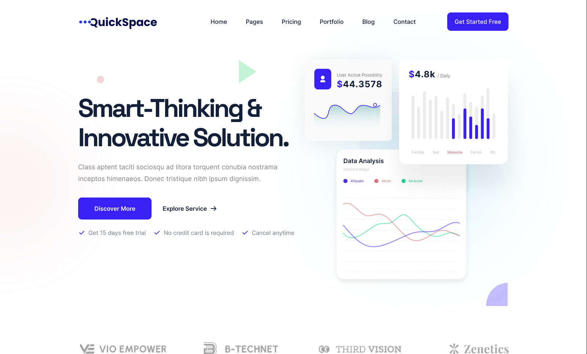

# Vue 3 + TypeScript + Vite Landing Page Template

This is a basic landing page template built using Vue 3 with TypeScript in a Vite environment. It integrates Tailwind CSS for styling purposes and includes custom components like a counter, accordion, and utilizes Swiper slider for carousel functionality. The unique aspect of this template is its content management via JSON format, where each section's content is controlled by passing objects as props to components. This enables easy customization of text and content without modifying the components directly.

## Recommended Setup

To enhance your development experience, we recommend using:

- [Visual Studio Code](https://code.visualstudio.com/) with [Vue - Official](https://marketplace.visualstudio.com/items?itemName=Vue.volar) extension (formerly Volar). It provides excellent support for Vue 3 development. We suggest disabling Vetur to avoid conflicts.
- Utilize [vue-tsc](https://github.com/vuejs/language-tools/tree/master/packages/tsc) for running type checks via the command line or generating d.ts files for Single File Components (SFCs).

## Installation

To get started with this template, follow these steps:

1. Clone this repository to your local machine:

   ```bash
   git clone https://github.com/hr-sobuj/vue-landing-page.git
   ```

2. Navigate into the project directory:

   ```bash
   cd vue-landing-page
   ```

3. Install dependencies using npm:

   ```bash
   bun install
   ```
    Or using npm:

   ```bash
   npm install
   ```
   Or using yarn:

   ```bash
   yarn install
   ```

## Usage

After completing the installation steps, you can start the development server by running:

```bash
bun run dev 
# or
npm run dev
# or
yarn dev
```

This command will start a development server and open your default web browser with the landing page.

## Features

- **Custom Counter:** A counter feature triggers when scrolling down the page, implemented without external packages.
- **Custom Accordion:** An accordion component for organizing content.
- **Swiper Slider Integration:** Utilizes Swiper slider for carousel functionality.
- **Responsive Design:** The landing page is fully responsive across various devices.

## Preview



You can view a live demo of this template [here](https://vue-landing-page-orpin.vercel.app/).

## Customization

To customize the content of each section, modify the JSON objects passed as props to the components. This allows for easy text and content changes without directly altering the components.
